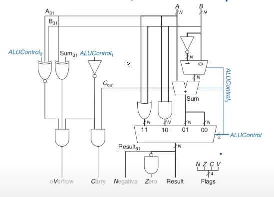
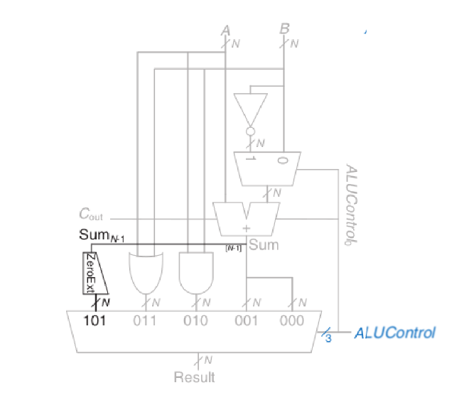

### About
This is an implementation of an ALU Design in verilog.
Extending the previous ALU Design with 3 bit ALU Control, Zero Extension and 
Negative, Zero, Carry and Overflow (N Z C V) flags.

### ALU Design (N Z C V Flags):

### ALU Desgin (Sign Extension):

