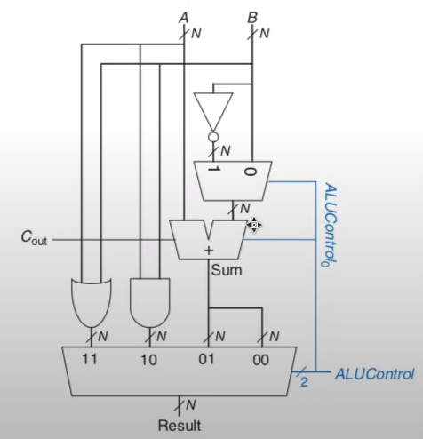

### About
This is a simple verilog implementation of a N-bit(N = 32bits for my case) ALU. The ALU supports 4 operations: addition, subtraction, bitwise AND and bitwise OR. The ALU also supports 2's complement negation. 

### ALU Circuit Design

