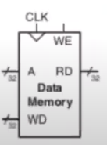

### About
Implementation of a data memory in verilog.
It  has 4 inputs and 1 output. 

| Input    | Working |
| -------- | ------- |
| A | Takes a 32 bit value (address) which is used to either store data or read data |
| WD | Takes in a 32 bit value which should be stored in A address |
| WE | A single bit value. 0 -> Read . 1 -> Write  |
| RD | Outputs the data at A address |

### Data Memory Diagram
