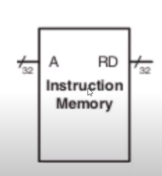

### About
Implementation of a single read port instruction memory in verilog. 
It takes 32 bit address as input and outputs the data at the particular address
to the output port(Rd).

### Instruction Memory Diagram
