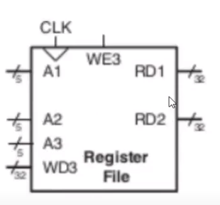

### About
Implementation of Register File in verilog. 
It has 5 inputs and 2 outputs :
| Input    | Working |
| -------- | ------- |
| A1  | Takes a 5 bit value (address) and outputs the data at that address to RD1 |
| A2 | Takes a 5 bit value (address) and outputs the data at that address to RD2 |
| A3    | Takes a 5 bit value in which the 32 bit data at WD3 should be stored in |
| WD3    | Takes in a 32 bit value which should be stored in A3 address |
| WE3 | A single bit value. 0 -> Don't write. 1 -> Allow write  |

### Register File Diagram
